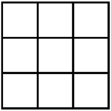

<h5>How many rectangles are there in a 4x4 grid, as shown below?</h5>

<h6>Answer: 36</h6>

To make a rectangle, we first need to pick 2 horizontal lines, and we have C(4,2)=6 ways to pick them. Similarly for vertical lines. So we have a total of 6*6=36 rectangles.

